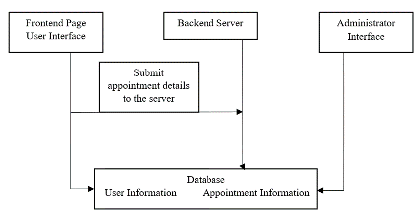
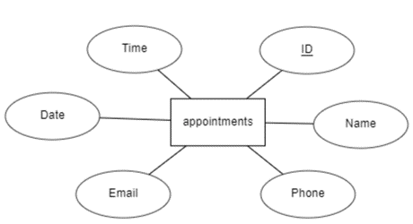

# SE_Project_Phase2_TeamX
### Chosen Development Model:
I’m using Agile to build the dental clinic website because it's flexible and can easily adjust to any changes I could encounter. With website development being so dynamic, Agile's iterative approach lets me work closely with stakeholders, getting feedback regularly and adjusting as needed. This way, I can ensure the website meets everyone's needs and stays up-to-date with any new requirements.
### User Requirements:
a. Stakeholders:
1. End-users: Patients seeking dental services, clinic staff (administrators, dentists, hygienists).
2. Owners: The dental clinic owners or managers.
3. Developers: Responsible for designing, developing, and maintaining the website.
4. Other relevant parties: Regulatory authorities (for compliance with data protection laws), marketing team (for website promotion).

b. User Stories:

1. Administrator: As an administrator, I want to be able to manage patient appointments easily. Benefit: Streamlined appointment management improves clinic efficiency and patient satisfaction.
2. Patient: As a patient, I want to be able to schedule appointments online. Benefit: Convenient online appointment scheduling saves time and provides flexibility for patients.
### Functional Requirements:
a. Brief Description:
1. Provide an online appointment scheduling system.
2. Display detailed information about dental services offered.
3. A webpage that enables the modification of the appointment information.

b. Acceptance Criteria:
1. The online appointment scheduling system should allow patients to book appointments.
2. Information about dental services should be clearly organized and easy to navigate.
3. The other webpage should let the admin do modification for the appointment information.
### Non-Functional Requirements:
a. Brief Description:
1. The website should load quickly and respond promptly to user interactions.
2. The interface should be intuitive and easy to navigate for both patients and clinic staff.
3. Data should be encrypted and protected to ensure patient confidentiality.
4. The website should be available and accessible to users at all times, with minimal downtime. 

b. Acceptance Criteria:
1. Pages should load within 2 seconds under normal traffic conditions.
2. Users should be able to complete common tasks (such as scheduling appointments) without needing assistance.
3. Patient data should be encrypted using industry-standard encryption protocols.

### Application Specifications:
a. Architecture:
1. The user sees the frontend page (first page), where he can make an appointment.
2. At the appointment, the details are stored in localhost.
3. The administrator doesn’t have access at localhost, but he will have access to another page where he could modify the details. 

4. This table outlines the components and flow of data in the described architecture:

•	Frontend Page (User Interface): Interface where users input appointment details.

• Backend Server: Remote server hosting the website, receives and stores appointment details.

•	Administrator Interface: Separate interface for administrators to manage appointment details.

•	Database: Stores appointment details including user information, appointment information, and any additional details.

### Database Model:

•	In sql, we have a table that stores the information. It includes ID, Name, Phone, Email, Date, Time.
 

### Technologies Used:
For technologies, I’ve chosen:
1. HTML, to create the structure and content of web pages.
2. CSS, to describe the presentation of the document written in HTML.
3. JavaScript, for dynamic functionality to the web page (such as login).
4. PHP, used to retrieve data from databases.
5. The framework I will use is Bootstrap, for creating a responsive, visually appealing, and feature-rich website efficiently.
### User Interface Design:
•	The system is going to have a page where the user can make an appointment. He is going to select a service, and a doctor. He is going to put his name and email as his personal details, and he is also going to choose the desired appointment date and time.
### Security Measures:
•	I will create a login page where the administrator can modify and contact the user based on the credentials and/or schedule that the user has written, so that they don’t have to go to PHPMyAdmin, since there are other databases. 

# SE_Project_Phase3_TeamX
# SE_Project_Phase3_TeamX
